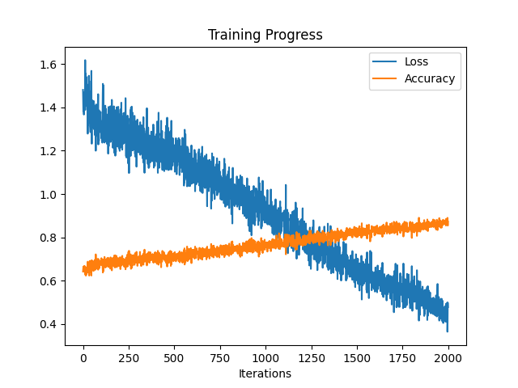

# Music Generation

### Generate Music with Machine Learning.

> deep-learning sequence-modeling attention attention-mechanism nlp transformer keras

This is an implementation of the Transformer for music generation. The music is represented in ABC notation, which consists of a song's metadata, e.g. the BPM, and its notes. The model takes the metadata as input, creates an encoding from it, and predicts notes given the context of this encoding and previous notes.

- In traditional sequence models, each point in the sequence is a bottleneck to all previous representations learned. The transformer avoids this problem by processing all tokens of the sequence simultaneously.

- Attention mechanism makes sure that at each point of the output sequence, the token is generated only from parts of the input that are relevant.

- With positional encoding the model is able to tell where a token lies in the sequence, despite the input being processed in parallel.

### Model Architecture

### Preprocessing
I chose subword tokenization over character or word tokenization to reduce the size of the vocabulary to be learned.

### Training
With a dataset size of 1000, a vocabulary size of 1000, an embedding size of 128, 4 encoder/decoder layers (Nx), 8 heads, and a batch size of 32, the model can take about 2000 iterations to converge, depending on the complexity of the dataset.

### Pretrained Weights
[Here are pretrained weights.](./models/weights.h5)

### Outputs
Below are some of the songs generated by the model.

- [First song](./best/song1.wav)
- [Second song](./best/song2.wav)
- [Third song](./best/song3.wav)
- [Fourth song](./best/song4.wav)
- [Fifth song](./best/song5.wav)

### Run the Model

This model has been deployed [to a mobile application](https://play.google.com/store/apps/details?id=com.apptasticmobile.composeium). Feel free to use it if you do not have the python environment needed to run the source code.
